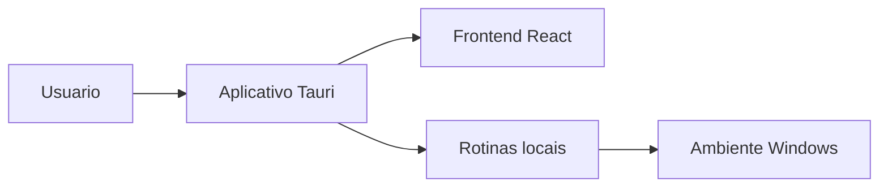

# Cronos IA

Aplicativo desktop/local para apoio pessoal e operacional, com foco em assistente, organizacao de informacoes, documentos e recursos de automacao em ambiente Windows.

## Visao Geral

O projeto combina frontend em React/TypeScript, runtime desktop Tauri e componentes Python. Pelo conteudo do repositorio, a proposta e oferecer uma aplicacao local para centralizar rotinas de assistente, diagnostico, documentos e organizacao.

## Problema Resolvido

O sistema busca reunir em um ambiente desktop ferramentas que normalmente ficariam espalhadas entre scripts, arquivos e interfaces separadas, facilitando o uso local em uma unica aplicacao.

## Principais Funcionalidades

### Funcionalidades Disponiveis

- Interface desktop com React e TypeScript.
- Estrutura Tauri para empacotamento local.
- Scripts e componentes relacionados a execucao no Windows.
- Areas de assistente, documentos e diagnostico identificadas na estrutura do projeto.

### Funcionalidades Em Desenvolvimento

- Integracoes e rotinas locais aparecem em scripts e arquivos do projeto.

### Funcionalidades Planejadas

- Informacao nao confirmada no conteudo atual do repositorio.

## Como Funciona

```text
Usuario abre o aplicativo local
-> interage com a interface desktop
-> a aplicacao aciona rotinas internas
-> arquivos, documentos ou dados locais sao processados
-> o resultado e exibido na interface
```

## Tecnologias Utilizadas

- TypeScript
- React
- Tauri
- Python
- PowerShell
- Node.js

## Arquitetura



## Estrutura Do Projeto

- `frontend/`: interface da aplicacao e estrutura desktop Tauri.
- `frontend/src-tauri/`: configuracoes e codigo do empacotamento desktop.
- `scripts/`: scripts auxiliares de runtime e diagnostico.
- Demais pastas: componentes e recursos de apoio ao aplicativo.

## Status

Projeto em desenvolvimento / aplicacao local. O estado de producao nao esta confirmado no conteudo atual do repositorio.

## Autor

Desenvolvido por Michele Santana — Kalion Tecnologia

Perfil profissional: https://github.com/Tr3mbolon4
